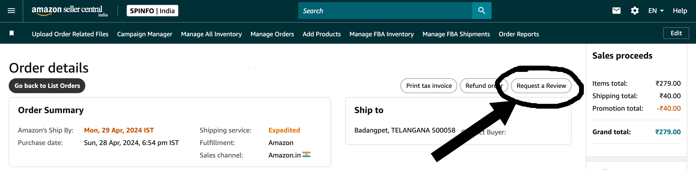

# Amazon Bulk Request Reviews

## Overview

**Amazon Bulk Request Reviews** is a Chrome extension designed to help Amazon sellers automate the process of sending bulk review requests for orders via the Amazon Seller Central dashboard. This tool streamlines the task of requesting customer feedback, making it easier to increase reviews and improve seller ratings on Amazon.

This tool is for Amazon sellers who frequently use the `Request a Review` button to ask customers for feedback and reviews. 

## Features

- **Automated Review Requests**: Send bulk review requests with a single click for all recent orders in Amazon Seller Central.
- **Seamless Integration**: Works directly with the Amazon Seller Dashboard to retrieve order information and send review requests.
- **Secure**: Uses session cookies from Amazon to authenticate, but does not store or share any personal or business data externally.
- **Easy to Use**: Simple user interface that makes bulk review requests easy without needing additional configurations.
- **Free**: This extension is free to use and is aimed at helping sellers improve their feedback management process.

## How It Works

1. **Install the Extension**: Add the extension to Chrome from the Chrome Web Store.
2. **Go to Amazon Seller Central**: Navigate to your Amazon Seller Central dashboard.
3. **Start Bulk Requests**: Click the extension icon in your browser, and press the "Start Bulk Requests" button to automatically send review requests for recent orders.
4. **Review Results**: Once the requests are sent, a success message will appear in the extension’s popup.

## Permissions

The extension requests the following permissions:

- **Cookies**: To access session information for Amazon Seller Central.
- **ActiveTab and Tabs**: To operate only when the user is on the relevant Amazon Seller Central page.
- **Host Permissions**: To interact with Amazon Seller Central’s API and fetch orders.
- **Storage**: To remember which orders have already been processed.

## Installation

1. Download or clone this repository.
2. Open the Chrome browser and navigate to `chrome://extensions/`.
3. Enable **Developer mode**.
4. Click **Load unpacked** and select the folder containing this extension.
5. The extension will be added to your browser toolbar, ready to use.

## Privacy

**Amazon Bulk Request Reviews** respects your privacy. The extension does not store or transmit any user data outside of your session on Amazon Seller Central. All actions are performed within your browser, and no personal or business data is collected or shared.

For more details, view the [Privacy Policy](https://raw.githubusercontent.com/sandippatel27899/Amazon-Bulk-Request-Review/refs/heads/master/privacy-policy.md).

## Support

If you encounter any issues or have questions, feel free to create an issue on the [GitHub Issues page](https://github.com/sandippatel27899/Amazon-Bulk-Request-Review/issues).

## License

This project is licensed under the Apache License. See the [LICENSE](https://raw.githubusercontent.com/sandippatel27899/Amazon-Bulk-Request-Review/refs/heads/master/LICENSE) file for more details.
